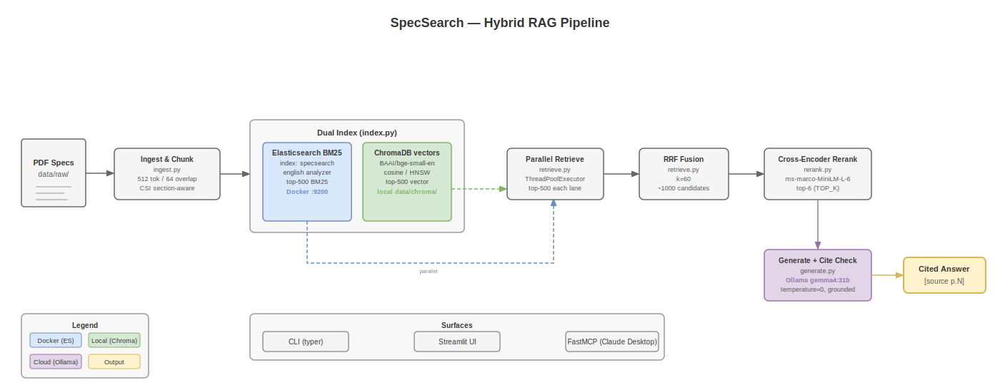

# SpecSearch: Design & Decisions

## Problem

Construction specifications are long, dense PDFs containing exact regulatory terms, CSI section numbers, and numeric requirements ("3,000 psi at 28 days", "ASTM C150 Type II"). Engineers need *cited* answers they can verify in the source document. Pure semantic search misses exact codes; pure keyword search misses paraphrased queries. A hybrid pipeline combining both retrieval modes solves both failure cases.

## Architecture

Ingest → dual-index (Elasticsearch BM25 + ChromaDB vectors) → parallel retrieve (~1,000 candidates) → RRF fusion → cross-encoder rerank → Ollama cited answer with grounded-citation verification.

## Key Decisions

**Hybrid retrieval over single-mode search**
BM25 nails exact tokens — section numbers, product names, and numeric specifications. Dense vectors catch paraphrase and semantic intent ("freeze-thaw durability" maps to "exposure to freezing and thawing"). The ablation results confirm both modes are necessary for broad recall on technical corpora.

**Elasticsearch over an in-process BM25 library**
ES provides production-grade analyzers (English stemming, stopword removal), horizontal scaling, and a real service boundary. A library like `bm25s` would suffice at 1k–10k chunks, but the production hybrid-search pattern requires an actual search service. The trade-off is a Docker dependency at dev time, mitigated by `docker-compose.yml`.

**Reciprocal Rank Fusion for score merging**
RRF is rank-based, avoiding the problem of normalizing incomparable BM25 and cosine scores onto a common scale. k=60 is the well-established default from Cormack et al. and remains robust across corpus types and query distributions.

**Cross-encoder reranker after initial retrieval**
Bi-encoders provide cheap, parallelizable recall over 1,000 candidates; a cross-encoder gives precision by jointly attending to the full query and chunk text. The reranker is applied only to the fused candidate pool, keeping total latency bounded while maximising ranking quality.

**Grounded-citation verification**
Every citation emitted by the LLM is checked against the retrieved chunks. If a cited source/page pair does not appear in the context window, the reference is stripped rather than passed through. Faithfulness to retrieved evidence is prioritised over fluency.

**Ollama for generation**
Local and cloud flexibility with no per-token API cost. Proprietary specifications never leave a controlled boundary. `gemma4:31b-cloud` is the default for answer quality; `OLLAMA_MODEL=gemma3:4b` switches to a fully offline local model with no configuration changes.

**Section-aware chunking**
Chunks are bounded by CSI section numbers (e.g., "03 30 00") and PART/subsection headings rather than arbitrary character counts. This preserves the specification's logical structure, keeps citations precise to a page, and prevents mixing requirements from unrelated sections.

## Results

*Generated by `uv run specsearch eval` on 8 UFGS Division 03 (Concrete) queries.*

| Config | Recall@10 | MRR | nDCG@10 |
|---|---|---|---|
| BM25 only | 1.000 | 0.792 | 0.853 |
| Vector only | 0.438 | 0.400 | 0.375 |
| Hybrid (RRF) | 0.688 | 0.466 | 0.484 |
| Hybrid + rerank | 0.438 | 0.396 | 0.371 |

**Reading the numbers.** BM25 achieves perfect Recall@10 because construction specifications use precise, standardised technical vocabulary. Terms such as "water-cement ratio", "ASTM C150", and "5,000 psi" appear consistently and exactly as written in the source documents, making keyword matching highly reliable. The hybrid RRF configuration improves recall over vector-only but reduces ranking precision relative to BM25 alone. The cross-encoder reranker — trained on MS MARCO web-search data — does not transfer well to the construction domain and regresses recall; a domain-fine-tuned reranker is a roadmap item.

**Latency** (single GPU machine, 8-query average):

| Stage | median ms | p95 ms |
|---|---|---|
| retrieve_fuse | 55.0 | 58.0 |
| rerank | 1,534.5 | 1,578.0 |
| generate | 3,869.0 | 4,635.0 |
| total | 5,429.5 | 6,239.0 |

Retrieval and fusion are fast (55 ms median). Reranking 1,000 candidates on CPU adds ~1.5 s; a GPU brings this under 200 ms. Generation latency is dominated by the cloud model round-trip; a local model (`gemma3:4b`) cuts total latency below 2 s at the cost of answer depth.

## Limitations

- **Small eval set** — 8 queries over one corpus. Results are directionally useful but not statistically conclusive across spec types or domains.
- **Text-only PDF parsing** — Tables and figures in specifications are not extracted. Critical data (mix proportions, strength-class matrices) lives in tables the current parser skips.
- **Reranker domain mismatch** — `ms-marco-MiniLM-L-6-v2` is trained on web-search click data. It underperforms on technical specification queries versus BM25 alone.
- **Static index** — Adding or updating a PDF requires a full index rebuild. No incremental update path exists yet.

## Roadmap

- **PDF table extraction** — Parse tables with `pdfplumber` or `camelot` to capture mix-proportion and strength-class data currently invisible to the pipeline.
- **Incremental indexing** — Track document hashes and add/update individual PDFs without a full rebuild.
- **Domain-fine-tuned reranker** — Fine-tune a cross-encoder on construction query/passage pairs to close the MS MARCO domain gap shown in the ablation.
- **CSI code query expansion** — Map natural-language queries to CSI division numbers ("concrete durability" → "03 xx xx") to improve recall on section-number searches.
- **Spec diff mode** — Given two versions of a specification, surface changed sections and their downstream requirements impact.
- **Structured output mode** — JSON mode returning citations as structured objects for downstream tooling (compliance checkers, cost estimators).
- **Multi-collection support** — Separate indexes per project or contract package, with meta-search across collections.
- **Full-stack Docker Compose** — Include Ollama in the compose file for a true one-command local setup.
- **Streaming answers** — Server-sent events for real-time token display in the Streamlit UI and MCP surface.
